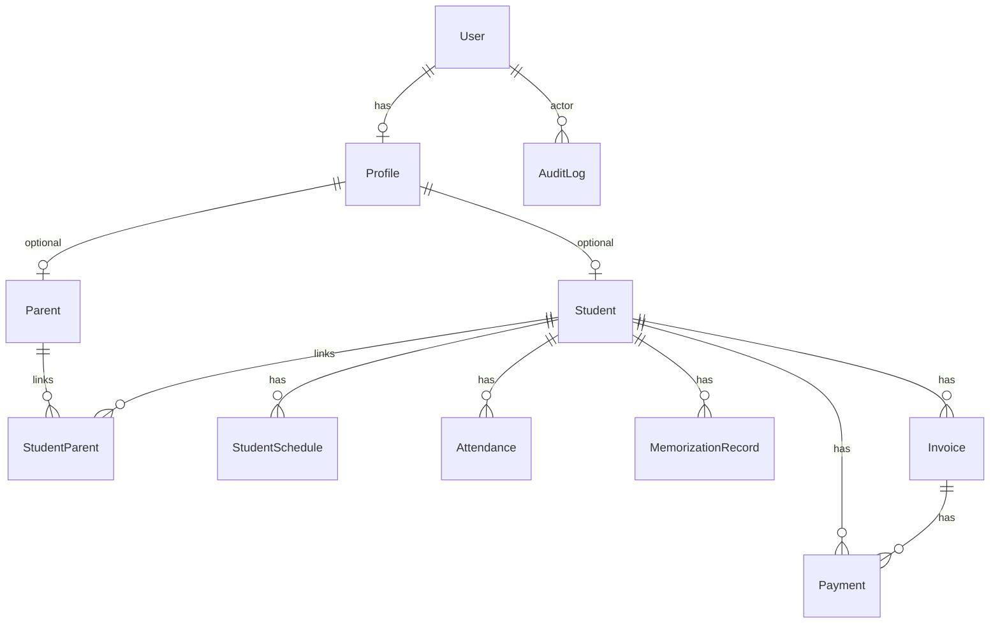

# تصميم قاعدة البيانات — نظرة عامة

## 1. ERD (مبسّط)

## 2. الجداول والغرض

| النموذج | الغرض |
|---------|--------|
| **User** | هوية الدخول (بريد/هاتف/اسم/دور/كلمة مرور). |
| **Profile** | ربط 1:1 بين مستخدم وبيانات إما طالب أو ولي أمر. |
| **Student** | البيانات الأكاديمية والإدارية للطالب. |
| **Parent** | ولي الأمر؛ ربط N:M مع الطلاب عبر **StudentParent**. |
| **StudentSchedule** | أيام الأسبوع + وقت بداية/نهاية الحصة. |
| **Attendance** | حالة حضور لكل (طالب + تاريخ) — فريد. |
| **MemorizationRecord** | حفظ / مراجعة / تسميع + آيات وملاحظات. |
| **Invoice** / **Payment** | المالية الأساسية. |
| **AuditLog** | تتبع إجراءات المشرف (قابل للتوسع). |
| **AcademySettings** | اسم الأكاديمية والمنطقة الزمنية. |

## 3. القيود المهمة

- `Attendance`: `@@unique([studentId, date])` لمنع تكرار يوم لنفس الطالب.
- **الحالات**: `StudentStatus` (منتظم، متوقف، مجمد، منسحب).
- **المبالغ**: `Decimal(12,2)` للفواتير والدفعات.

## 4. فهارس مقترحة للتقارير

- موجودة: `Student.status`, `Student.fullName`, `Attendance.date`, `MemorizationRecord(studentId, sessionDate)`.
- لاحقًا: مركّب على `(date, status)` للحضور حسب اليوم.

## 5. سياسات لاحقة (غير مطبّقة بعد)

- **نظام الحفظ المتقدم (مناطق + جلسات + محرك تلقائي):** راجع التصميم الكامل في [`MEMORIZATION_SYSTEM.md`](./MEMORIZATION_SYSTEM.md) (مقترح لاحقاً بجانب/بدلاً من `MemorizationRecord` الحالي).
- أرشفة منطقية بدل حذف فيزيائي للطلاب المنسحبين.
- نسخ احتياطي منطقي للجداول الحساسة إلى تخزين خارجي.
- **Multi-tenant**: إضافة `academyId` على الكيانات الرئيسية عند التحول لـ SaaS متعدد.
