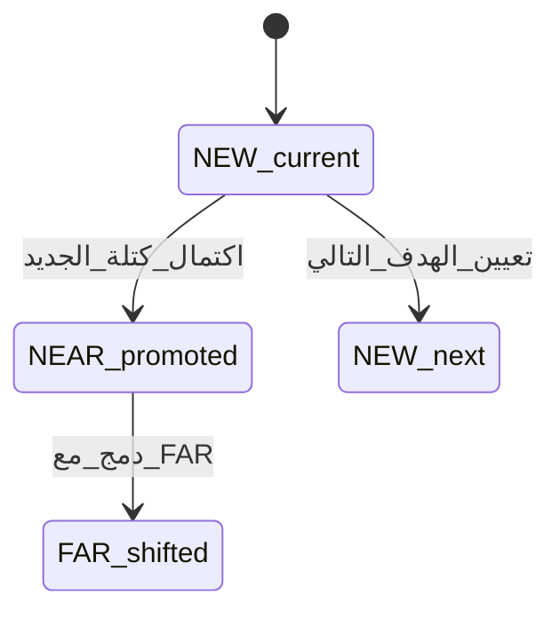
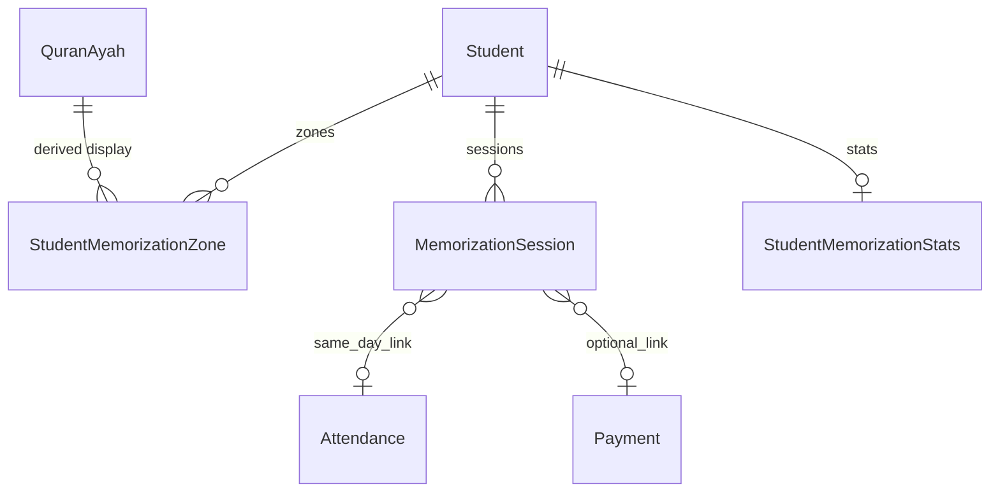
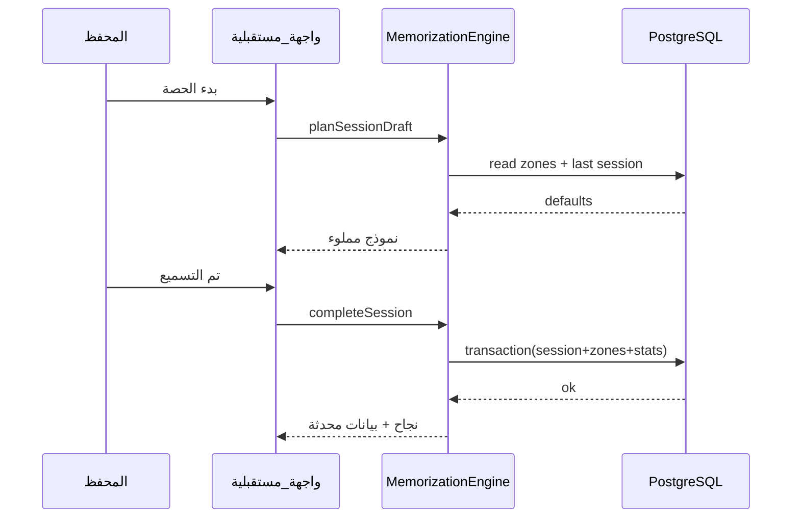
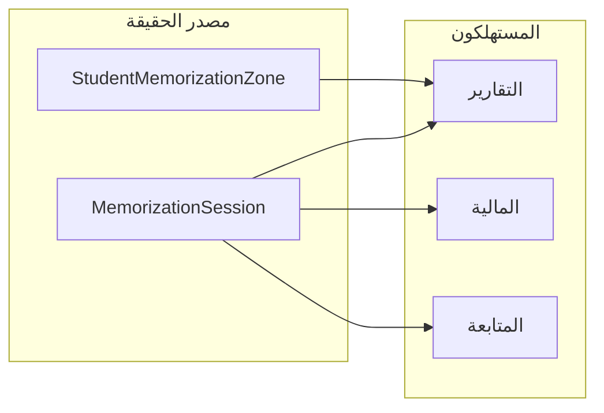

# نظام الحفظ والتسميع — تصميم المنطق، القاعدة، الجلسات، والتحديث التلقائي

> **نطاق هذا المستند:** تصميم هندسي ووظيفي فقط (Logic / DB / Engine / Workflow).  
> **لا يشمل:** بناء واجهات UI كاملة أو تنفيذ كل الملفات البرمجية — يُستند إليه في مرحلة التنفيذ لاحقًا.

## خريطة المطابقة — المطلوب الـ7

| # | المطلوب | أين في المستند |
|---|---------|----------------|
| 1 | Logic System للحفظ | §1، §3، §4، §17 |
| 2 | العلاقات الخاصة بالحفظ | §5 (ERD + كيانات) |
| 3 | Session Engine | §4.2–4.3، §5.1، §12 |
| 4 | Auto Memorization Update | §3.2، §6، §13، §14 |
| 5 | أفضل Structure للنظام | §4.1، §15 |
| 6 | كيف يعمل النظام داخليًا | §2، §4، §10، §12–§14 |
| 7 | Workflow سريع للمحفظ | §9 + مخطط التسلسل |

---

## 1. الرؤية: Memorization Zones + Sessions كمصدر حقيقة

- **مناطق الحفظ الثلاث** (`NEW` / `NEAR_REVIEW` / `FAR_REVIEW`) هي **حالة مجمّعة حالية** لكل طالب، تُحدَّث آلياً بعد كل حصة مكتملة.
- **سجل الحصة (Session)** هو **حدث زمني غير قابل للتعديل المنطقي** (أو قابل للتصحيح بسياسة audit) يحتوي **لقطات (snapshots)** لما تم في تلك الحصة من جديد/قريب/بعيد + تقييم + ملاحظات + واجب + مدة + دفع.
- **التقارير والمالية والمتابعة** تقرأ من **الجلسات** + **المناطق الحالية** + **مجاميع مشتقة** (يمكن تخزينها مادياً أو حسابها عند الطلب حسب الأداء).

---

## 2. تمثيل المواضع القرآنية داخلياً (Ranges — ليس اسم سورة فقط)

### 2.1 القرار المعماري

| الطبقة | الوصف |
|--------|--------|
| **Canonical** | حدود كل مدى تُخزَّن كـ **نقطة بداية ونقطة نهاية** في مرجع موحّد قابل للمقارنة والترتيب. |
| **عرض بشري** | السورة/الآية (والاشتقاق: صفحة، جزء، حزب) يُشتق من جدول مرجعي ثابت في التطبيق أو جدول `QuranRef` في DB. |

### 2.2 اقتراح التخزين الداخلي (مُوصى به)

- **`surahNumber`** (1–114) + **`ayahNumber`** (1..n داخل السورة) لكل من **البداية** وال**النهاية**.
- **ترتيب قابل للمقارنة:** حساب **`globalAyahIndex`** (1…6236) عند الحفظ أو كعمود مُشتق ومخزّن للفهرسة السريعة — يُبنى من جدول مرجعي `QuranAyah(surah, ayah, page, juz, hizb)` مرة واحدة (بيانات ثابتة).
- **صفحة / جزء / حزب:** لا تُعتمد كمصدر وحيد للحدود (لأن الحدود غالباً بين آيات)؛ تُخزَّن كـ **denormalized** للعرض والتقارير أو تُحسب من المرجع عند القراءة.

### 2.3 نوع المدى (اختياري للتوسع)

```text
RangeUnit: SURAH_AYAH (افتراضي) | PAGE_SPAN | JUZ_SPAN | HIZB_SPAN
```

للـ MVP: **`SURAH_AYAH`** كافٍ؛ الأنواع الأخرى تُضاف لاحقاً كتحويل من/إلى آيات.

---

## 3. مناطق الحفظ الثلاث — التعريف والسلوك

### 3.1 التعريفات

| المنطقة | المعنى | مثال سلوكي |
|---------|--------|-------------|
| **NEW** | الحفظ الجديد **الحالي** الذي يُضاف عليه في الحصص. | من المعارج 1 → 20. |
| **NEAR_REVIEW** | **آخر كتلة** أُنجزت من NEW قبل الانتقال — «الماضي القريب» للمراجعة المكثفة. | بعد إكمال المعارج والبدء بالحاقة: المعارج كاملة تدخل NEAR. |
| **FAR_REVIEW** | المراجعة **البعيدة** — تُجمّع الأجزاء الأقدم وفق سياسة (انزلاق زمني / حجم / إكمال دورات). | ما سبق NEAR يزحف إلى FAR تدريجياً. |

### 3.1.1 مثال مطابق لطلبك (المعارج → الحاقة)

- **قبل:** `NEW` = المعارج 1→20 (أو حتى نهاية السورة حسب سياسة «الإكمال»)، `NEAR` قد يحمل مثلاً نوح→الناس (مدى **آيات** مُخزَّن كـ `startGlobalIndex`/`endGlobalIndex` وليس كأسماء فقط).
- **حدث:** الطالب أتم المعارج في الجديد والمحرك يثبت «اكتمال الكتلة»، والهدف التالي للجديد = **الحاقة** من الآية 1.
- **بعد (تلقائي):**
  1. نطاق المعارج المكتمل يُسجَّل في **سجل الجلسة** + **سجل أرشيفي** اختياري للمناطق.
  2. محتوى `NEAR` السابق يُدفَع إلى `FAR` (STACK أو MERGE حسب §6).
  3. المعارج (كاملةً أو المكتمل منها حسب السياسة) تصبح **`NEAR`**.
  4. `NEW` يُضبط على **الحاقة** من البداية المعتمدة.
  5. تُحدَّث `StudentMemorizationStats` ونسبة الإنجاز والواجب وآخر تسميع — **دون ضغطات إضافية** بعد «تم التسميع».

### 3.2 قواعد الانتقال التلقائي (Auto Progression) — عند «إكمال» كتلة الجديد

**مُدخل:** الحصة الأخيرة تُثبت أن نطاق NEW المستهدف قد **اكتمل** حتى نهاية السورة (أو نهاية الوحدة المعتمدة في الأكاديمية — قابل للتكوين).

**مخرجات ذرّية (في معاملة DB واحدة):**

1. **أرشفة النطاق المكتمل** من NEW إلى تاريخ «اكتمال» (للتتبع والتقارير).
2. **إزاحة المناطق:**
   - المحتوى الحالي لـ **NEAR** ينتقل إلى **FAR** (دمج أو دفع حسب السياسة — انظر §6).
   - المحتوى الذي كان **NEW** (السورة المكتملة) يصبح **NEAR**.
   - **NEW** يُعاد ضبطه إلى بداية السورة/النطاق التالي (مثلاً الحاقة من الآية 1) — إما من إعداد يدوي مسبق «خطة الحفظ» أو من نفس الحصة (حقل «الهدف التالي»).
3. **تحديث مشتقات:** `lastSessionAt`, `lastRecitationGrade`, counters الحصص، **نسبة إنجاز** (تعريفها في §8)، **الواجب القادم** (من الحصة أو من قاعدة قواعد).

> **لا تدخل يدوي من المحفظ** بعد الضغط على «تم التسميع» — كل ما سبق داخل **Memorization Engine** + **Session Completion Handler**.



---

## 4. Memorization Engine — طبقات المنطق

### 4.1 وحدات مقترحة (Structure داخل `src/features/memorization-v2/` مثلاً)

| المسار | المسؤولية |
|--------|-----------|
| `domain/` | أنواع `MemorizationZone`, `QuranRange`, `SessionRating`, قواعد عدم التناقض، أخطاء نطاق. |
| `domain/policies/` | سياسات: **PromotionPolicy**, **FarMergePolicy**, **HomeworkPolicy**. |
| `application/` | حالات استخدام: `StartSession`, `CompleteSession`, `RecomputeStudentStats` (استدعاء من action واحد). |
| `infrastructure/` | Prisma transactions، قراءة المرجع القرآني، مؤقتات الأداء. |

### 4.2 واجهة محرك مُجرّد (مفهومي)

- **`getZones(studentId)`** — القراءة الحالية.
- **`planSessionDraft(studentId)`** — اقتراح حقول افتراضية للحصة (من آخر حصة + المناطق).
- **`completeSession(command)`** —  
  `command` يشمل: `attendance`, `newWork`, `nearWork`, `farWork`, `ratings`, `notes`, `homework`, `durationMin`, `payment`  
  → يُنفَّذ: حفظ Session + استدعاء **`applyProgression(result)`** إذا استوفى شروط الإكمال.

### 4.3 Session Update Logic

- **قبل الحفظ:** التحقق من صلاحية المحفظ، حالة الطالب (منتظم/…)، عدم ازدواجية «حصة لنفس الطالب في نفس الطابع الزمني» إن لزم (سياسة: حصة واحدة/يوم أو أكثر — قابل للتكوين).
- **أثناء الحفظ:** Transaction: `INSERT Session` + تحديثات `Zone` + `INSERT OutboxEvent` (اختياري للتقارير اللاحقة) + `UPDATE StudentStats`.
- **بعد الحفظ:** `revalidatePath` للوحات ذات الصلة (بدون UI هنا — فقط عقد).

---

## 5. تصميم العلاقات في قاعدة البيانات (مقترح Prisma — المرحلة التالية)

> الجدول الحالي `MemorizationRecord` **لا يكفي** لنموذج المناطق + الجلسة الشاملة. يُقترح **إبقاؤه مؤقتاً** للتوافق أو **ترحيل تدريجي** إلى النماذج أدناه.

### 5.1 كيانات أساسية

**`QuranAyah`** (جدول مرجعي ثابت — seed مرة)

- `surahNumber`, `ayahNumber`, `page`, `juz`, `hizb`, `globalAyahIndex`

**`StudentMemorizationZone`**

- `studentId`, `zone` (`NEW` | `NEAR_REVIEW` | `FAR_REVIEW`)
- `startSurah`, `startAyah`, `endSurah`, `endAyah`
- `startGlobalIndex`, `endGlobalIndex` (مُستحسن للفهرسة)
- `updatedAt`, `version` (تفاؤل مقفل للتحديث المتزامن — اختياري)

قيود مقترحة:

- `@@unique([studentId, zone])` — صف واحد حي لكل منطقة لكل طالب.

**`MemorizationSession`** (قلب النظام — كل حصة سطر مستقل)

| الحقل (مفهومي) | مطابقة المطلوب | ملاحظات |
|------------------|-----------------|----------|
| `id`, `studentId` | — | |
| `sessionDate` أو `startedAt`/`endedAt` | **التاريخ** | فهرسة `(studentId, sessionDate)` للتقارير |
| `attendanceId` أو `attendanceStatus` | **حالة الحضور** | يُفضّل FK لـ `Attendance` لنفس اليوم كمصدر واحد |
| `newSnapshot` | **الجديد** | JSON منظم (انظر §13) |
| `nearSnapshot` | **الماضي القريب** | نفس الشكل |
| `farSnapshot` | **الماضي البعيد** | نفس الشكل |
| `ratingOverall` | **التقييم** | `EXCELLENT` \| `VERY_GOOD` \| `GOOD` \| `WEAK` (ممتاز / جيد جداً / جيد / ضعيف) |
| `notes` | **الملاحظات** | نص حر |
| `homeworkNext` | **الواجب القادم** | نص أو هيكل JSON (آيات/صفحات) |
| `durationMinutes` | **مدة الحصة** | دقائق |
| `paymentStatus` + `paymentId?` / `invoiceId?` | **حالة الدفع** | ربط لاحق بالمالية دون كسر الجلسة |
| `status` | — | `DRAFT` \| `COMPLETED` \| `VOID` (للمسودات قبل «تم التسميع») |
| `createdById`, `createdAt` | — | المحفظ (ADMIN) |

**لقطات المناطق (JSON):** تُخزَّن **ما تم فعلياً في الحصة** وليس بالضرورة تساوي حالة المناطق بعد الترقية؛ أما **المناطق المُحدَّثة** فتُكتب في `StudentMemorizationZone` في نفس المعاملة عند `COMPLETED`.

**`MemorizationSessionEvent`** (اختياري — تدقيق)

- تسلسل أحداث داخل الحصة إن احتجت تعديلات جزئية قبل «الإتمام».

**`StudentMemorizationStats`** (مشتق — للوحة الطالب السريعة)

- `completionPercent` (تعريف واضح في §8)
- `sessionsCount`, `absencesCount` (أو يُجمع من الحضور)
- `lastSessionAt`, `lastRecitationRating`
- `monthlyStatsJson` أو جداول شهرية لاحقاً

### 5.2 ERD مقترح (مبسّط)



---

## 6. Auto Memorization Update System — خوارزمية دمج FAR

**خياران (يُختار أحدهما في الإعدادات):**

| السياسة | الوصف |
|---------|--------|
| **STACK** | FAR يبقى قائمة **مرتبة** من النطاقات؛ عند دفع NEAR → FAR يُضاف النطاق في الأعلى/الأسفل حسب «الأقدمية». |
| **MERGE** | إذا كان النطاق الجديد متجاوراً لنطاق FAR (بفهرس عالمي)، **ادمج** في مدى واحد لتقليل التجزئة. |

**NEAR بعد الترقية:** عادة **مدى واحد** = آخر سورة/كتلة أُنجزت من NEW.  
**FAR:** قد يصبح **عدة مديات**؛ واجهة المحفظ في المستقبل تعرض «دفعات مراجعة» وليس سطراً واحداً فقط.

---

## 7. التقييمات (لكل Session)

| القيمة | تخزين |
|--------|--------|
| ممتاز | `EXCELLENT` |
| جيد جداً | `VERY_GOOD` |
| جيد | `GOOD` |
| ضعيف | `WEAK` |

- ملاحظات نصية حرة مع Session.
- اختياري لاحقاً: تقييم **منفصل** لكل منطقة (NEW/NEAR/FAR) إن رغبت بتفصيل أداء المراجعة.

---

## 8. لوحة الطالب (Dashboard) — مصادر الأرقام

| المؤشر | المصدر المقترح |
|--------|----------------|
| نسبة الإنجاز | دالة `computeCompletion(student)` تعتمد **خطة الحفظ** (جدول `StudentStudyPlan` لاحقاً) أو نسبة آيات/صفحات مُنجزة مقابل الهدف السنوي — **يجب تثبيت التعريف في الإعدادات**. |
| آخر تسميع | `MemorizationSession` الأحدث بحالة مكتمل. |
| عدد الحصص | `count(MemorizationSession)`. |
| أيام الغياب | من `Attendance` أو من `attendanceStatus` داخل الجلسة — **يُفضّل مصدر واحد**: `Attendance` كمرجع ونسخ snapshot في الجلسة. |
| إحصائيات شهرية | تجميع `MemorizationSession` حسب الشهر. |
| مستوى التقدم | مشتق من المناطق + معدل الإكمال + التقييم الأخير (قاعدة نقاط بسيطة قابلة للتوسع). |

---

## 9. Workflow المحفظ — أقل ضغطات (4 خطوات)

1. **صفحة الطالب** → زر **«بدء الحصة»** (يُنشئ مسودة `Session` بحالة `DRAFT` أو يفتح نموذجاً بحالة محلية حتى الإرسال).
2. في شاشة واحدة (مُجمّعة):
   - **حضر / غاب** (وإن غاب: سياسة — إما إنهاء الحصة بدون تقدم أو حصة «إعادة جدولة» — يُحدد في السياسة).
   - **الجديد / القريب / البعيد:** حقول نطاق (من/إلى) مُعبأة افتراضياً من `StudentMemorizationZone` + آخر حصة.
   - **التقييم** (الأربع قيم) + ملاحظات مختصرة.
3. **«تم التسميع»** → استدعاء **`completeSession`**:
   - حفظ Session بحالة `COMPLETED`.
   - تشغيل **Promotion** إذا تحقق شرط «إكمال الجديد».
   - تحديث **الإحصائيات** و**الواجب القادم** و**آخر تسميع**.
4. **إغلاق** — بدون خطوات إضافية إلزامية.



---

## 10. العلاقة بالمالية والحضور (لتلبية شرط «كل شيء على Sessions»)

- **الحضور:** عند إتمام الحصة، إما:
  - **Upsert** `Attendance` لذلك التاريخ بنفس الحالة، أو
  - **FK** من `MemorizationSession.attendanceId`.
- **الدفع:** `paymentStatus` على الجلسة؛ عند ربط لاحق بـ `Invoice`/`Payment`، يُحدَّث الحقل أو يُنشأ سطر ربط دون تغيير منطق الجلسة الأساسي.

---

## 11. خطة التنفيذ المقترحة (بدون بناء UI الآن)

1. إضافة نماذج Prisma الجديدة + ترحيل + `seed` لجدول `QuranAyah`.
2. تنفيذ **MemorizationEngine** + اختبارات وحدة لسياسات NEAR/FAR.
3. استبدال/تجاوز `MemorizationRecord` تدريجياً بـ `MemorizationSession`.
4. بعدها بناء UI سريع «بدء الحصة / تم التسميع».

---

## 12. Session Engine — تفصيل داخلي

### 12.1 حالات الجلسة

- **`DRAFT`:** بعد «بدء الحصة» — يمكن حفظاً تلقائياً (auto-save لاحقاً) دون تأثير على المناطق.
- **`COMPLETED`:** بعد «تم التسميع» — تُنفَّذ المعاملة الكاملة (حضور + Session + Zones + Stats + ترقية).
- **`VOID`:** إلغاء إداري — لا يُعاد منه حساب التقدم (مع `AuditLog`).

### 12.2 شكل JSON مقترح للّقطة `QuranRangeSnapshot`

```json
{
  "unit": "SURAH_AYAH",
  "start": { "surah": 71, "ayah": 1, "globalIndex": 5420 },
  "end": { "surah": 71, "ayah": 20, "globalIndex": 5439 },
  "derived": { "startPage": 568, "endPage": 568, "juz": 29, "hizb": 58 }
}
```

- **`derived`** اختياري وقت الكتابة (للسرعة) أو يُحسب عند القراءة من `QuranAyah`.

### 12.3 دالة `completeSession` — خطوات ذرّية

1. تحميل أقفال الطالب (`SELECT … FOR UPDATE` على صفوف المناطق + إحصائيات إن وُجدت).
2. التحقق من صلاحية المحفظ وحالة الطالب.
3. Upsert حضور اليوم إن لزم.
4. `INSERT MemorizationSession(status=COMPLETED, …snapshots…)`.
5. تحديث `StudentMemorizationZone` من نتيجة الجلسة (ما تم تسميعه) — **قبل** الترقية.
6. إذا `promotionCriteriaMet(session)` → **`applyAutoProgression()`** (§14).
7. `recomputeStudentStats(studentId)` — نسبة الإنجاز، آخر تسميع، عداد الحصص، مستوى التقدم.
8. `COMMIT` — أي فشل → `ROLLBACK` بدون جزئيات.

---

## 13. Auto Memorization Update System — ما يحدث بعد «تم التسميع» فقط

| # | فعل تلقائي |
|---|-------------|
| 1 | حفظ **Session** كاملة (لقطات + تقييم + ملاحظات + واجب + مدة + دفع). |
| 2 | مزامنة **الحضور** مع مصدر التقارير. |
| 3 | تحديث **مناطق الحفظ** وفق ما أُنجز في الحصة (قد لا يغيّر NEAR/FAR إن لم يكتمل الجديد). |
| 4 | إن وُجد **إكمال كتلة الجديد** → **نقل** المكتمل من NEW إلى NEAR، **دفع** NEAR القديم إلى FAR، **تهيئة** NEW للهدف التالي. |
| 5 | **إعادة حساب التقدم** و**نسبة الإنجاز** (حسب تعريف الإعدادات). |
| 6 | تحديث **الواجب القادم** و**آخر تسميع** و**التقدم العام** في `StudentMemorizationStats`. |

لا خطوات واجهة إضافية مطلوبة من المحفظ بعد الزر.

---

## 14. سياسة «إكمال الجديد» (قابلة للتكوين)

| سياسة | متى تُفعّل الترقية التلقائية |
|--------|------------------------------|
| `END_OF_SURAH` | وصل الطالب في NEW إلى **آخر آية في السورة** الحالية. |
| `PLAN_CHUNK` | وصل إلى نهاية **حزمة الخطة** (مثلاً 20 آية) حتى لو وسط السورة — يتطلب جدول **`StudentStudyPlan`** أو حقلاً على الطالب. |
| `MANUAL_CONFIRM` | لا ترقية تلقائية إلا إذا علّم المحفظ checkbox «اكتملت الكتلة» — **أبطأ**؛ غير مُوصى به لطلبك الحالي. |

**الافتراضي المقترح للسرعة:** `END_OF_SURAH` + احتياطي `PLAN_CHUNK` لاحقاً.

---

## 15. هيكل المجلدات المقترح (`src/features/memorization-v2/`)

```text
memorization-v2/
  domain/
    types.ts              # QuranRangeSnapshot, ZoneType, SessionStatus
    errors.ts
    policies/
      promotion.ts        # NEAR→FAR, NEW→NEAR
      merge-far.ts        # STACK vs MERGE
      completion.ts       # END_OF_SURAH / PLAN_CHUNK
  application/
    complete-session.ts   # orchestration
    plan-draft-session.ts
    recompute-stats.ts
  infrastructure/
    prisma-zones.repo.ts
    prisma-sessions.repo.ts
  README.md               # روابط لهذا المستند
```

الواجهات (`components/`) تُضاف لاحقاً وتستدعي فقط `application/*` عبر Server Actions.

---

## 16. التقارير والمالية مبنية على Sessions



- **شهري/سنوي:** تجميعات على `sessionDate` + `ratingOverall`.
- **مالية:** `paymentStatus` على الجلسة → ربط بـ `Payment` عند التحصيل دون تغيير منطق الحصة.

---

## 17. ملخص للمعماري

- **Zones** = حالة لحظية قابلة للمقارنة عبر **نطاقات آيات مرقمة**.
- **Session** = مصدر حقيقة للتقارير والمالية والمتابعة.
- **Engine** = معاملة واحدة تربط الإدخال البشري السريع بتحديثات آلية للمناطق والإحصائيات.

هذا المستند يكفي كعقد تصميم (Design Contract) لمرحلة التنفيذ التالية.
